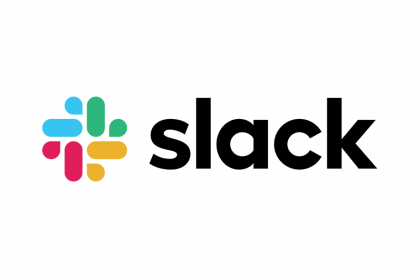

# Newman - SlackBot application [](https://github.com/RichardLitt/standard-readme)



## Description

This application is a tool which allows you to send, through a message/report, all the information about your Postman collection tests.

Through a simple call to your new Slack bot (`@API_Reporter start)`, you can check the current status of your APIs or execute a bunch of Postman tests to ensure that everything is going well at the moment.

## 📌 Methodologies and Guidelines

These are the methodologies and guides.

- [GitHub flow](https://guides.github.com/introduction/flow/)

Visual Studio Code Editor configurations and plugins.

- [jsdoc](https://marketplace.visualstudio.com/items?itemName=stevencl.addDocComments)
- [ESLint](https://marketplace.visualstudio.com/items?itemName=dbaeumer.vscode-eslint)

## ⚡️ Technologies and Tools

- [NodeJS](https://nodejs.org/)
- [Typescript](https://www.typescriptlang.org/)
- [Newman](https://www.npmjs.com/package/newman)
- [Slackbots](https://www.npmjs.com/package/slackbots)
- [Jest](https://jestjs.io/docs/en/getting-started)
- [Babel](https://babeljs.io/)
- [Husky](https://www.npmjs.com/package/husky) - Pre-commit hook


## ✅ Prerequisites

In order to work with this project, your local environment must have at least the following versions:

* NodeJS Version: 10.xx or higher
* NPM Version: 6.12.0

## 📐 How to work with this project

You have to do the following steps to be able to work with this project and deploy it in the different AWS environments.

### 1️⃣ Add the enviroments files

To set the application configurations to work properly with your project settings, you need to create a '.env' file in the root directory.

```bash
├── .env 🔌
|   ├── POSTMAN_COLLECTION_NAME       # Postman collection file name
|   ├── POSTMAN_ENVIRONMENTS_NAME     # Postman environment file name (optional)
|   ├── SLACK_BOT_TOKEN               # Slack bot user token
|   ├── SLACK_BOT_NAME                # Bot name to be displayed in Slack
|   ├── SLACK_BOT_ID                  # Bot user id 
|   └── PROJECT_NAME                  # Project name to be displayed in the message
└──
```

### 2️⃣ Add postman collection and environment

You need to put your **postman collection with tests** and **postman environment files** *(environment file is optional)* in the `assets` folder, which is the folder where the application is going to read the files from.

### 3️⃣ Install NodeJS Dependencies

To work with this project locally, it's necessary to install the NPM dependencies.

```bash
# Install npm dependencies
$npm i
```

### 4️⃣ Development

To start working locally with the project you will need to execute the following command :

```bash
# Development
$npm run start:watch
```

To run the unit tests for this project you will need to execute the following command `(Work in progress, not available at the moment)`:

```bash
# Unit Tests
$npm run test
```

To run the linters for this project you will need to execute the following command:

```bash
# ESLint linter
$npm run lint

# Duplicated code
$npm run lint:copy-paste
```

## 📂 Code scaffolding

```any
/
├── assets 🌈               # Images Sources.
|   └── ...                 # ...
|   |
├── doc
|   └── qac 🔰              # Quality Assurance Code.
|       └── ...             # ...
|
├── .env 🔌                 # Environment file to setup env variables.
|   |   └── ...             # ...
|   |
├── src
|   ├── config              # Generic config
|   ├── tools               # Generic tools
|   ├── types               # Generic types
|   |
|   ├── index.ts        # Application startup. Main execution
|   |
|   └── ...
└── ...
```

## 📦 Core and Libraries

This project is based on `Newman` cli library which allows us to execute the postman collections & tests for the report side

In other side, we have `Slackbots` to notify with a simpler report through Slack the status of the execution.

### 📊 **Newman**

Newman is a command-line **collection runner for Postman**. It allows you to effortlessly run and test a Postman collection directly from the command-line. It is built with extensibility in mind so that you can easily integrate it with your continuous integration servers and build systems.

### 🤖 **Slackbots**
This is Node.js library for easy operation with Slack API.

It also exposes all opportunities of **Slack's Real Time Messaging API**.

## Happy Code

Created with Typescript! ⚡ and latin music 🎺🎵

### This README.md file has been written keeping in mind

- [GitHub Markdown](https://guides.github.com/features/mastering-markdown/)
- [Emoji Cheat Sheet](https://www.webfx.com/tools/emoji-cheat-sheet/)
